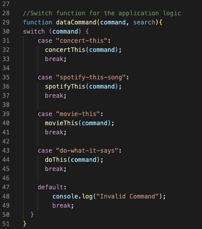
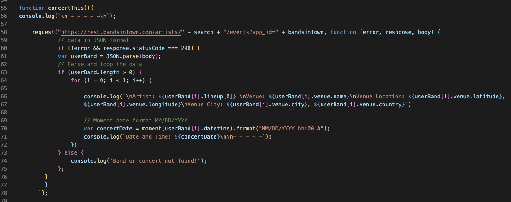
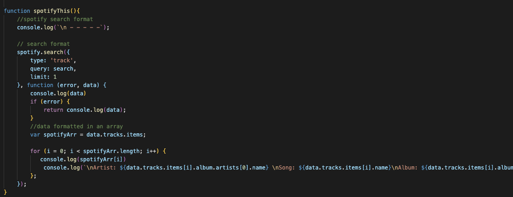
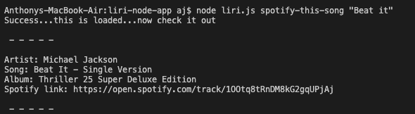
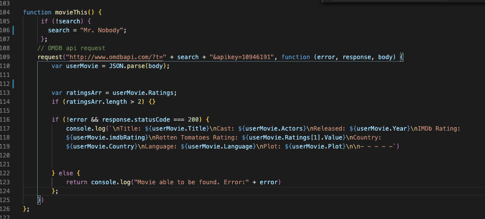
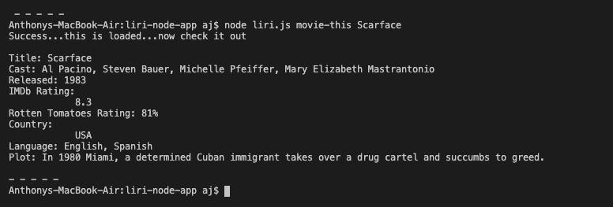
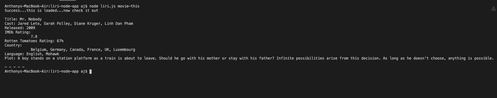
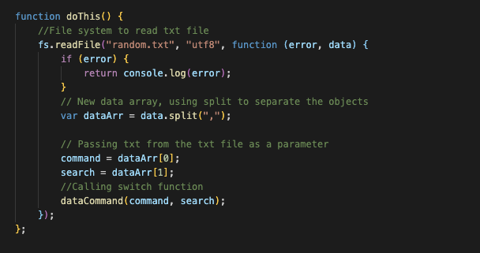
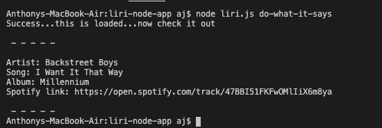

# liri-node-app

Similar to SIRI for iPhone, this is LIRI (Language Interpretation and Recognition Interface). Liri
is a command line node app that takes parameters and returns the data.

Packages Installed:
Dotenv - Dotenv is a zero-dependency module that loads environment variables from a .env file into process.env. 

Request - Request is designed to be the simplest way possible to make http calls. It supports HTTPS and follows redirects by    default.

Moment - A lightweight JavaScript date library for parsing, validating, manipulating, and formatting dates.

Fs - built in node package (File systems)

Spotify - A simple to use API library for the Spotify REST API.

Npm, www.npmjs.com/.

How it works

Using switch case, 4 commands are passed depending on which command is chosen followed by the search case. Each command
will return the specified data for each concert, song, and movie. The "do-what-it-says" function is a spotify call working the same as "spotify-this-song".

1. concert-this

User inputs the command(concert-this) and the search criteria(Artist) and the Name, Venue, Venue City, and Date/Time returns.

2. spotify-this-song

User inputs the command(spotify-this-song) and the search criteria(song) and artist, song, album, and spotify link will be returned

3. movie-this

User inputs the command(movie-this) and the search criteria(movie) and the movie title, cast, release date, imdb and rotten tomatoes rating, country, language and plot will be returned

4. do-what-it-says

User inputs the command(do-what-it-says) and the file system will read the contents of the "random.txt" file. Which in this case holds the spotify command, so the server reads spotify-this-song followed by the search criteria and executes as if you ran the spotify command directly.

and artist, song, album, and spotify link will be returned

